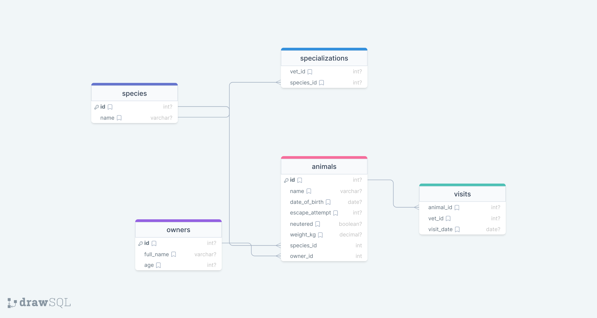

# curriculum-databases-projects-template

> This template should be used for database related projects at Microverse.
> Generate your own repository, update this README and edit all files content while working on projects. You should not be adding any new files unless asked otherwise.

## schema diagram

## Getting Started

This repository includes files with plain SQL that can be used to recreate a database:

- Use [schema.sql](./schema.sql) to create all tables.
- Use [data.sql](./data.sql) to populate tables with sample data.
- Check [queries.sql](./queries.sql) for examples of queries that can be run on a newly created database. **Important note: this file might include queries that make changes in the database (e.g., remove records). Use them responsibly!**

## Authors

👤 **mavhungu rotshidzwa**

- GitHub: [@rotshidzw](https://github.com/rotshidzw)
- Twitter: [@rotshidzwamavh1](https://twitter.com/rotshidzwamavh1)
- LinkedIn: [rotshidzwa mavhungu](https://www.linkedin.com/in/rochidzwa-chester-8062b6211/)

## 🤝 Contributing

Contributions, issues, and feature requests are welcome!

Feel free to check the [issues page](../../issues/).

## Show your support

Give a ⭐️ if you like this project!

## Acknowledgments

- Hat tip to anyone whose code was used
- Inspiration
- etc

## 📝 License

This project is [MIT](./MIT.md) licensed.
